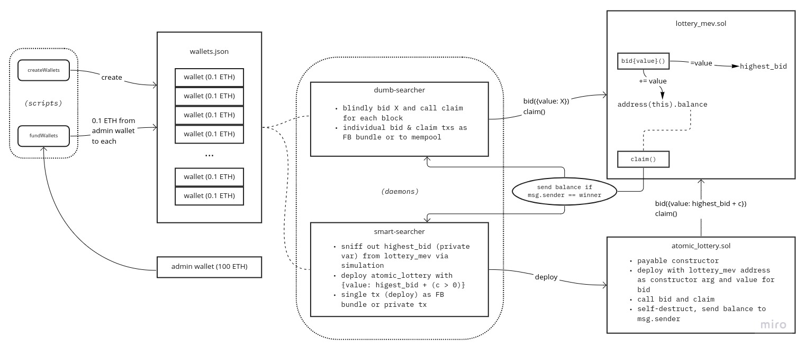

# mev-flood

## the game

Call `bid`, placing a bet by setting `value`, and send the highest bid (which may be in _addition_ to others' bids in the block) before calling `claim`. The winner (the person who called bid with the highest `value` this round), upon calling `claim` gets the entire balance of the contract, at which point `highest_bid` (also the minimum to land a new bid) resets (to `1e9` wei). `claim` will also only pay out if you placed the _most recent_ bid.

## system details



mev-flood is a multi-daemon project, and is designed to be run in parallel with other instances, each using the same source code but different params.

### features

Daemons

* **dumb-searcher:** blindly sends bid (constant `value`) & claim txs on every block
  * mostly fails and wastes money on bids (for others to take)
  * sends to FB builder, may also send to mempool (pending how/what we want to test)
* **smart-searcher:** finds winning bid amount and uses a smart contract that atomically executes bid+claim to win the pool
  * if only one instance is run, it's practically guaranteed to win every round
  * if more than one instance is run, they will generate "conflicting" bundles
    * technically all the bundles will land but their profits will be affected by who gets included first
* 100 test accounts to send from (+1 admin account)
* `claim` does not revert when called by a non-winner (on purpose, to add technical complexity to the game)

Scripts

* **createWallets**: creates new `wallets.json` file populated w/ 100 wallets
* **fundWallets**: send 0.1 ETH to each wallet in `wallets.json` from admin wallet (defined by env `ADMIN_PRIVATE_KEY`)

## setup

```sh
yarn install

# pick your poison:
cp .env.example .env.goerli
cp .env.example .env.sepolia

vim .env
```

_Set preferred environment:_

```sh
export NODE_ENV=sepolia
```

_Generate test accounts:_

```sh
yarn script.createWallets
```

_Fund test accounts (careful, it sends 0.1 ETH to 100 accounts):_

```sh
yarn script.fundWallets
```

## run

_Run dumb-search simulator with 5 accounts (careful, it currently sends to mempool without checking for profit):_

```sh
yarn dumb-dev 0 5
```

Note: 5 is the _exclusive_ end index, meaning that arguments (`0 5`) will use `wallets[0, 1, 2, 3, 4]`.

_Run smart-search simulator._

```sh
yarn smart-dev
```

### production

```sh
yarn build
yarn dumb-search $i $j
yarn smart-search
```

### mempool testing

You might need to use the mempool to test your transactions' validity before trying to use the bundle API.

```sh
yarn dumb-dev 13 14 mempool
```

### stress-test example

_Run 49 dumb searchers and 2 smart searchers (a relatively realistic case):_

```sh
# terminal 1 (49 test wallets)
yarn dumb-dev 0 49

# terminal 2 (49 test wallets)
yarn dumb-dev 49 98

# terminal 3 (2 test wallets)
yarn smart-dev 98 100
```

### other features

_Get bundle stats:_

```sh
yarn script.getBundleStats 0x40d83aebb63f61730eb6309e1a806624cf6d52ff666d1b13d5ced535397f9a46 0x7088e9
# alternatively you can use int block number
yarn script.getBundleStats 0x40d83aebb63f61730eb6309e1a806624cf6d52ff666d1b13d5ced535397f9a46 7375081
```

_Send private tx:_ (sends some ETH from adminWallet to itself)

```sh
yarn script.sendPrivateTx
```

_Cancel private tx:_

```sh
yarn script.cancelPrivateTx 0xca79f3114de50a77e42dd595c0ba4e786d3ddf782c62075ec067fe32329e3ea2
```
